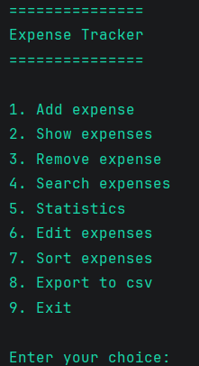
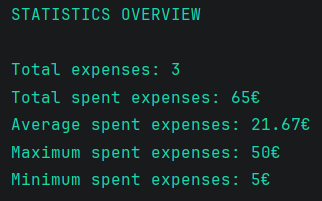
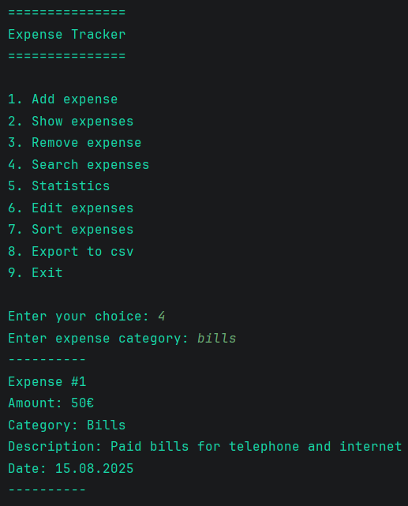

# 💰 Expense Tracker

Expense Tracker is a command-line application written in Python that helps users record, organize, search, and analyze their expenses through a simple command-line interface.

The project focuses on clean object-oriented programming, file handling, data persistence, and building practical software that solves real-world problems.

This is my fourth Python portfolio project, built to practice object-oriented programming, file handling, data persistence, and input validation while creating a practical command-line application.

---

## 📸 Screenshots

### Main Menu



### Statistics



### Search Expenses



---

## ✨ Features

* Add expenses
* View all expenses
* Edit expenses
* Delete expenses
* Search expenses by category
* Sort expenses by amount, category, or date
* Expense statistics
* Export expenses to CSV
* Automatic JSON save/load
* Input validation

---

## 🛠 Technologies Used

* Python 3
* Object-Oriented Programming (OOP)
* JSON
* CSV
* datetime
* Git
* GitHub

---

## 📁 Project Structure

```text
expense-tracker/
│
├── images/
│   ├── expense_tracker_main_menu.png
│   ├── expense_tracker__stats.png
│   └── expense_tracker__search.png
│
├── main.py
├── expense.py
├── expense_manager.py
├── storage.py
├── menu.py
├── constants.py
├── expenses.json
├── README.md
├── LICENSE
└── .gitignore
```

---

## 🚀 Getting Started

Clone the repository:

```bash
git clone https://github.com/TheEzio5/expense-tracker.git
```

Navigate to the project folder:

```bash
cd expense-tracker
```

Run the application:

```bash
python main.py
```

---

## 📖 Skills Demonstrated

* Object-Oriented Programming (OOP)
* File handling
* JSON serialization
* CSV export
* Input validation
* Sorting and searching algorithms
* Basic data analysis
* Git version control

---

## 📌 Future Improvements

* Monthly reports
* Budget limits by category
* SQLite database integration
* Charts and graphs
* GUI version (Tkinter or PyQt)

---

## 👤 Author

**Robert Banjad**

GitHub: https://github.com/TheEzio5
